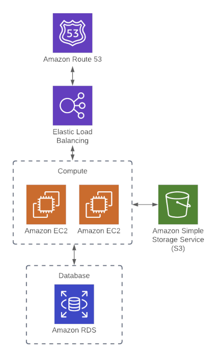

## Remote Backend Storage for Terraform State files
Storing terraform state files locally is insecure and thus we prefer methods that helps infrastructure collaboration more securely.

### Method 1: Terraform Cloud
Store the terraform state file into terraform's cloud remote backend.

### Method 2: Use AWS S3 + DynamoDB for remote backend
- S3 helps with storing the state file in a secure manner
- DyanmoDB helps with ensuring a lock for only 1 user to access the file at a time and avoid conflicts when using `terraform apply`

### Application example
The application script runs the following flow as per the diagram:

- Creates two EC2 instances
- Creates and access an S3 bucket
- Creates an RDS instance
- Introduces a Load balances
- Configures a Route 53 DNS server

